<div align="center">

# 💎 Compliflow: The Future of Issue Tracking

[](https://vitejs.dev/)
[](https://reactjs.org/)
[](https://nodejs.org/)
[](https://mongodb.com/)
[](https://tailwindcss.com/)

**An avant-garde, ultra-secure MERN ecosystem meticulously crafted for seamless grievance redressal and enterprise-grade issue management.**  
*Quantum-grade security • Fluid Glassmorphism • Intelligent AI Synthesis • Real-time Synchronicity*

[🚀 Fast Track](#-fast-track) • [📖 Architecture](#-architecture) • [✨ Elite Features](#-elite-features) • [🛠️ Technology Stack](#️-technology-stack)

---

</div>

## ✨ Elite Features

<table>
<tr>
<td width="50%">

### 🤖 **Intelligent AI Synthesis**
- **Live Assistant**: A cutting-edge AI companion integrated directly into the interface.
- **Contextual Guidance**: Real-time support for issue reporting and status inquiries.
- **Seamless Interaction**: Powered by sophisticated LLM integration for an intuitive user journey.

</td>
<td width="50%">

### 🎭 **Avant-Garde Aesthetics**
- **Glassmorphism Core**: A breathtaking UI built on high-translucency layers and backdrop blurs.
- **Mesh Gradient Environments**: Dynamic, flowing backgrounds that respond to user presence.
- **Micro-Interaction Suite**: Fluid animations powered by Framer Motion for a tactile feel.

</td>
</tr>
<tr>
<td width="50%">

### 🔐 **Fortified Ecosystem**
- **JWT-OIDC Security**: Military-grade authentication and session management.
- **Granular RBAC**: Highly specific role-based access controls for enterprise scaling.
- **Sanitized Perimeters**: Exhaustive input validation and rate-limiting protocols.

</td>
<td width="50%">

### 🌓 **Ambient Transitions**
- **State-of-the-Art Dark Mode**: A meticulously tuned low-light environment for reduced ocular strain.
- **Liquid Responsiveness**: An ergonomic, mobile-first design that adapts with fluid grace.
- **Premium Typography**: A curated trio of Inter, Outfit, and Poppins for maximum legibility.

</td>
</tr>
</table>

---

## 🚀 Fast Track

> **Prerequisites:** Node.js 18+ • MongoDB Atlas Cluster • Curiosity

### 📦 Orchestration

```bash
# Clone the masterpiece
git clone https://github.com/atharva-lotankar/CompliFlow_Website.git
cd CompliFlow_Website
```

<details>
<summary><b>⚙️ Backend Infrastructure</b></summary>

```bash
cd backend
npm install
cp .env.example .env
```

**Configure your `.env` matrix:**
```env
MONGODB_URI=mongodb+srv://...
JWT_SECRET=...
PORT=5000
NODE_ENV=production
```

```bash
# Ignite the core
npm run dev
```
✅ Backend synchronized on `http://localhost:5000`

</details>

<details>
<summary><b>🎨 Frontend Interface</b></summary>

```bash
cd frontend
npm install
```

**Configure your `.env` interface:**
```env
VITE_API_BASE_URL=http://localhost:5000/api
```

```bash
# Launch the visualizer
npm run dev
```
✅ Frontend projected on `http://localhost:5173`

</details>

### 🎉 Welcome to the Future
Navigate to `http://localhost:5173` to experience the paradigm shift in issue tracking.

---

## 🛠️ Technology Stack

<div align="center">

### Frontend Visualization


### Backend Core


</div>

---

## 🗺️ User Odyssey

```mermaid
graph TD
    Start((✨ Start)) --> Auth{🔐 Portal}
    Auth -->|Guest| Landing[🏖️ Discovery]
    Auth -->|User| Dashboard[📊 Command Center]
    Dashboard --> AI[🤖 AI Assistant]
    Dashboard --> Issues[📝 Issue Genesis]
    Issues --> Resolve[✅ Resolution]
    Resolve --> End((💎 Success))
    
    style Start fill:#f9f9f9,stroke:#333Box
    style End fill:#BEF264,stroke:#365314,color:#365314
    style AI fill:#6366f1,color:#fff
    style Auth fill:#4ecdc4,color:#fff
```



---

## 📂 Architecture

```
📁 compliflow/
├── 📁 backend/
│   ├── 📁 src/
│   │   ├── 📁 controllers/      # 🎮 Intelligence & Logic
│   │   ├── 📁 models/           # 🗃️ Data Cartography
│   │   ├── 📁 routes/           # 🛣️ Neural Pathways
│   │   └── 📁 middleware/       # 🛡️ Sentinel Protocols
├── 📁 frontend/
│   ├── 📁 src/
│   │   ├── 📁 components/       # 🧩 Atomic UI Entities
│   │   ├── 📁 features/         # 🎯 Domain Specializations
│   │   │   ├── 📁 admin/        # 👑 Sovereign Controls
│   │   │   └── 📁 issues/       # 📝 Grievance Modules
│   │   └── 📁 api/              # 🌐 Peripheral Communication
└── 📄 README.md                 # 📖 The Grimoire
```

---

## 🤝 Contribution & Legacy

We invite visionaries to contribute to this evolving ecosystem. Please refer to our [Charter](CONTRIBUTING.md) for details.

<div align="center">

### 🌟 Commemorate the Project

If this vision resonates with you, consider bestowing a ⭐️!

[](https://github.com/atharva-lotankar/CompliFlow_Website/stargazers)

---

**Meticulously engineered with ❤️ by [Atharva Lotankar](https://github.com/atharva-lotankar)**

© 2026 CompliFlow Dynamics. All rights reserved.

</div>
